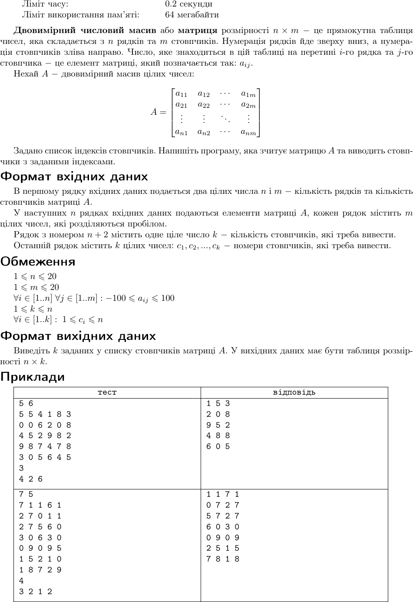

# Lab Work Report №3

## Навчальна дисципліна "Програмування для мобільних пристроїв"

### Виконала:
- Бабачанах К.С.
- група 6.04.122.010.21.2

## Хід роботи

Усього було 10 задач, які я змогла зробити на 100 балів. В завданнях було використано Class, Lambda, fields of class, properties, expression statements (if, when, try) that return value. Завдання були виконани у відповідних гілках та було створено Unit Test для кожного завдання. 

1. Перше завдання з id 1302 було виконано з першої спроби на 100 балів. Але потім я зробила наступну спробу змінив код : я додала Lambda и expression. Також було отримано 100 балів за нове рішення.
   

2. Друге завдання з id 1322 було виконано з першої спроби на 100 балів. Ніяких проблем не виникло.
   

3. Третє завдання з id 1335 було виконано з першої спроби на 100 балів. Ніяких проблем не виникло.
   

4. Четверте завдання з id 1353 було виконано з першої спроби на 100 балів. Ніяких проблем не виникло.
   

5. П'ятє завдання з id 1384 було виконано з першої спроби на 100 балів. Ніяких проблем не виникло.
   

6. Шосте завдання з id 1393 було виконано з першої спроби на 100 балів. Ніяких проблем не виникло.
   

7. Сьоме завдання з id 1411 було виконано з першої спроби на 100 балів. Ніяких проблем не виникло.
   

8. Восьме завдання з id 1507 було виконано на 100 балів з другої спроби. Перша спроба була помилка WA через те що був інший вивод даних, але функціонал працював коректно.
   

9. Дев'яте завдання з id 1514 було виконано з першої спроби на 100 балів. Ніяких проблем не виникло.
   

